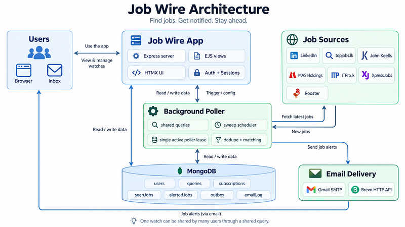
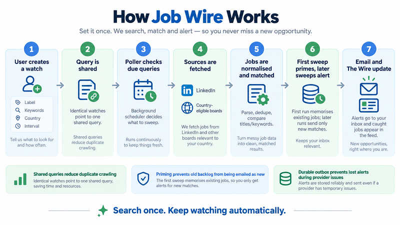

# Job Wire

### Multi-source job monitoring and early email alerts

Job Wire watches job sources continuously, remembers what it has already seen,
matches new postings against a user's watches, and sends alerts without making
the user repeatedly search the same sites by hand.

[Live site](https://jobwire.me) · [Scaling notes](docs/SCALING.md) · [MIT License](LICENSE)

---

## What is Job Wire?

A normal job search is pull-based: open several sites, type the same search,
refresh, repeat, and hope you notice a useful vacancy early enough.

Job Wire turns that into a watch.

A user chooses:

- one or more job-title keywords;
- a country;
- a polling interval between 5 and 60 minutes.

The application then decides which sources can serve that country, checks them
in the background, normalises the different source formats into one job shape,
deduplicates postings it has already observed, and sends new matching jobs to
the user's inbox.

For Sri Lanka, one watch currently reaches **seven sources**. For other
supported countries, LinkedIn provides the country-wide source.

> Job Wire is an alerting system, not an auto-apply bot. It finds and surfaces
> postings; the user still decides what to apply for and applies on the
> original employer/job-board page.

---

## Why it exists

Many useful vacancies are time-sensitive. Checking job boards once or twice a
day means a posting can collect a large application pile before the candidate
even knows it exists.

Job Wire is designed around one simple idea:

**search once, keep watching automatically.**

The system is intentionally honest about a limitation that matters: Job Wire
cannot see a posting before a source exposes it publicly. Some sources publish
immediately; LinkedIn's public discovery surfaces can lag behind the employer's
posting time. The project's measured latency and scaling work is documented in
[docs/SCALING.md](docs/SCALING.md).

---

## Current source coverage

Source selection is derived from the watch's country. Users do not need to know
which checkbox to select for which board.

| Source | Coverage | Integration | Posting-time precision |
|---|---|---|---|
| **LinkedIn** | 45 verified countries | public HTML/search surfaces | minute |
| **topjobs.lk** | Sri Lanka | HTML + locally maintained functional-area corpus | day |
| **John Keells Group** | Sri Lanka | server-rendered careers HTML | day |
| **MAS Holdings** | Sri Lanka | Oracle Recruiting JSON API | day |
| **ITPro.lk** | Sri Lanka | server-rendered HTML | minute |
| **XpressJobs** | Sri Lanka | JSON API used by the site's frontend | no reliable publish time |
| **Rooster** | Sri Lanka / applicable remote roles | JSON API used by the site's frontend | treated as day precision |

The 45 country entries available to the user are not arbitrary strings. Their
LinkedIn geo IDs are kept in <code>src/services/linkedin/geoIds.js</code> and
are exposed only after verification.

### A note about source reliability

Not every source is a supported public API. Some adapters read public HTML or
undocumented endpoints used by a site's own frontend. Those interfaces can
change.

The adapters therefore try to detect **success-shaped failures**: a source can
still return HTTP 200 while a selector, response shape, filter, or pagination
rule has silently stopped returning the jobs the application expects.

The source layer is designed to fail loudly when it cannot decide whether an
empty result is real.

---

## Product features

### Watches

A watch is what a user creates: a label, keywords, a country, and a requested
interval.

Under the hood, identical watches share one canonical query. If ten users watch
the same keywords in the same country, Job Wire does not create ten identical
network crawls. It stores ten subscriptions that point to one shared query.

### Automatic source selection

The country decides which adapters participate.

A Sri Lankan watch reaches all seven current sources. A German watch, for
example, does not waste requests on Sri Lankan employer portals.

### Priming before alerts

The first sweep of a brand-new query memorises the jobs that already exist and
sends nothing.

Without this rule, creating a watch would immediately email the user an old
backlog and make “new alert” meaningless.

### The Wire

Signed-in users get a feed of jobs caught by their watches.

The feed supports:

- source filtering;
- progressively loading older matches;
- delivery status;
- per-watch labels;
- relative discovery time;
- posting-age information only when the source publishes a clock precise
  enough to support it.

The wire updates through HTMX without turning the application into a
client-heavy single-page app.

### Email alerts

Mail can be delivered through:

- **Gmail SMTP** for local/small deployments; or
- **Brevo's HTTP API** when <code>BREVO_API_KEY</code> is configured.

The mail path includes a durable outbox, retry handling, delivery logs, provider
health checks, and Brevo idempotency keys so a retry does not become a duplicate
email when the provider already accepted the first request.

### Accounts and verification

Job Wire includes:

- email/password signup;
- bcrypt password hashing;
- six-digit email verification;
- password reset by verification code;
- session invalidation after password changes;
- MongoDB-backed sessions.

A signup password is staged until the email address is verified. This prevents
somebody from registering another person's email address with an attacker-chosen
password and having the real owner accidentally bless it later.

### Admin area

Admin access is controlled by <code>ADMIN_EMAILS</code>, not by a user-editable
database role.

The admin tools cover operational tasks such as:

- user/account support;
- query inspection;
- manual sweeps;
- parking/resuming searches;
- watch administration;
- duplicate-query cleanup;
- delivery health and email status.

### Operational safety

The application also includes:

- a fenced MongoDB poller lease so overlapping instances do not crawl at the
  same time during a rolling deploy;
- heartbeat/progress reporting;
- crawl and sweep telemetry;
- source-coverage checks;
- graceful shutdown;
- a durable alert ledger separate from the short-lived user feed;
- a health endpoint at <code>/healthz</code>.

---

## Architecture

Job Wire is intentionally a small server-rendered system rather than a set of
microservices.

The Express web server and the background poller start from the same Node.js
process. MongoDB is the shared persistent state, and the poller lease protects
against two live processes doing the same crawl simultaneously.

  

### Technology stack

| Layer | Technology |
|---|---|
| Runtime | Node.js 20+ / ES modules |
| Web server | Express 4 |
| Views | EJS |
| Partial updates | HTMX + small vanilla JavaScript modules |
| Database | MongoDB |
| Sessions | express-session + connect-mongo |
| HTML parsing | Cheerio |
| Email | Nodemailer/Gmail SMTP or Brevo HTTP API |
| Authentication | bcryptjs + emailed OTP codes |
| Container | Node 20 Alpine |
| CI/CD | GitHub Actions + Docker Buildx |
| Production image | GHCR ARM64 image for the Raspberry Pi deployment path |

---

## How a sweep works

  

The infographic above is the newcomer view. The simplified poller flow below shows the same process from the scheduler's point of view:

~~~text
poller tick
  |
  +-- acquire / renew fenced lease
  |
  +-- find due shared queries
  |
  +-- open a source snapshot/pass
  |
  +-- for each due query
        |
        +-- resolve sources for the query's country
        +-- fetch source data
        +-- parse and normalise jobs
        +-- match the watch keywords
        +-- check the long-lived alert ledger
        |
        +-- first sweep?
        |     yes -> remember current jobs, send nothing
        |
        +-- later sweep?
              -> save new feed rows
              -> create durable outbox obligations
              -> send/retry email
              -> reschedule the query
~~~

Queries are processed carefully rather than firing every request in parallel.
Different source hosts can be fetched concurrently where safe, while per-source
pagination and expensive search-specific work remain controlled.

The detailed request-cost model, shared snapshot strategy, measured source lag,
and scheduler limits live in [docs/SCALING.md](docs/SCALING.md).

---

## Data model

The names below are MongoDB collections/concepts used by the current code.

| Collection / concept | Purpose |
|---|---|
| <code>users</code> | accounts, password hashes, verification state |
| <code>queries</code> | one row per distinct shared search |
| <code>subscriptions</code> | a user's watch pointing to a shared query |
| <code>seenJobs</code> | recent matched jobs used by The Wire |
| <code>alertedJobs</code> | long-lived “already observed/claimed” ledger used for dedupe |
| <code>outbox</code> | durable email work that still has to be delivered |
| <code>emailLog</code> | send attempts and delivery history |
| <code>pollerLease</code> / poller state | single-active-poller coordination and liveness |
| <code>crawlLog</code> | source crawl telemetry |
| <code>sweepRuns</code> | sweep-level telemetry |
| <code>observations</code> | source health/coverage observations |
| <code>telemetryCoverage</code> | records when particular telemetry became available |

### Why queries and subscriptions are separate

This is one of the most important design choices in the project.

~~~text
User A ─┐
User B ─┼── subscriptions ──> one shared query: "intern / Sri Lanka"
User C ─┘
                              |
                              +--> one scheduled search
                              +--> one remembered history
                              +--> results fan out to subscribers
~~~

Network load should grow with distinct searches, not directly with the number
of users.

---

## Repository structure

~~~text
Job-Wire/
├─ src/
│  ├─ server.js                 Express app, startup and graceful shutdown
│  ├─ config/
│  │  ├─ db.js                  MongoDB connection
│  │  └─ env.js                 environment parsing and validation
│  ├─ middleware/               auth, session, CSRF, rate limits, theme
│  ├─ models/                   MongoDB accessors, indexes, ledger, outbox
│  ├─ routes/                   landing, auth, wire, watches, admin
│  ├─ services/
│  │  ├─ auth/                  password + OTP logic
│  │  ├─ http/                  guarded outbound HTTP
│  │  ├─ linkedin/              LinkedIn URL/parser/geo helpers
│  │  ├─ mail/                  transports, outbox worker, templates
│  │  ├─ onboarding/            starter-watch logic
│  │  ├─ poller/                loop, sweep, retry, snapshot, runtime state
│  │  └─ sources/               one adapter per job source
│  ├─ utils/                    matching, sanitising, timing, rendering
│  └─ views/                    EJS layouts, pages and partials
├─ public/                      CSS, browser JS, icons and README images
├─ scripts/                     tests, probes, maintenance and diagnostics
├─ docs/
│  └─ SCALING.md                measured scaling/cost analysis
├─ .github/workflows/ci-cd.yml  syntax check + ARM64 image build/publish
├─ Dockerfile
├─ compose.yml
├─ render.yaml
├─ railway.json
└─ package.json
~~~

The codebase contains detailed comments explaining why many non-obvious rules
exist. For this project, those comments are useful operational history: several
bugs were not crashes; they were successful requests that quietly returned less
data than expected.

---

## Local development

### Requirements

Before starting, install or provide:

- **Node.js 20 or newer**
- **npm**
- a reachable **MongoDB** database
- an email provider:
  - Gmail with an app password, or
  - Brevo with a REST API key

### 1. Clone

~~~bash
git clone https://github.com/Zacky-Ahmed/Job-Wire.git
cd Job-Wire
~~~

### 2. Install dependencies

~~~bash
npm install
~~~

For reproducible CI/production installs, use:

~~~bash
npm ci
~~~

### 3. Create the environment file

macOS/Linux:

~~~bash
cp .env.example .env
~~~

PowerShell:

~~~powershell
Copy-Item .env.example .env
~~~

Then edit <code>.env</code>.

### 4. Minimum configuration

For Gmail SMTP:

~~~dotenv
NODE_ENV=development
PORT=3000
APP_URL=http://localhost:3000

MONGODB_URI=mongodb+srv://...
MONGODB_DB=jobwire

SESSION_SECRET=replace-with-a-long-random-string

GMAIL_USER=you@gmail.com
GMAIL_APP_PASSWORD=your-16-character-app-password
MAIL_FROM=Job Wire <you@gmail.com>

POLLER_ENABLED=false
~~~

For Brevo instead of Gmail:

~~~dotenv
MONGODB_URI=mongodb+srv://...
SESSION_SECRET=replace-with-a-long-random-string

BREVO_API_KEY=xkeysib-...
MAIL_FROM=Job Wire <alerts@your-domain.example>
~~~

When <code>BREVO_API_KEY</code> is set, Gmail credentials are optional.

> For UI work, keep <code>POLLER_ENABLED=false</code>. Running a local poller
> against a production database can create real network traffic and real email.

### 5. Start the app

~~~bash
npm run dev
~~~

Open:

~~~text
http://localhost:3000
~~~

Health check:

~~~text
http://localhost:3000/healthz
~~~

---

## Environment variables

The complete validation/default logic is in <code>src/config/env.js</code>.
The most important settings are:

| Variable | Purpose |
|---|---|
| <code>NODE_ENV</code> | <code>development</code> or <code>production</code> |
| <code>PORT</code> | HTTP port, default 3000 |
| <code>APP_URL</code> | public base URL used in links and mail |
| <code>MONGODB_URI</code> | **required** MongoDB connection string |
| <code>MONGODB_DB</code> | database name, default <code>jobwire</code> |
| <code>SESSION_SECRET</code> | **required** session-signing secret |
| <code>GMAIL_USER</code> | Gmail SMTP account when Brevo is not used |
| <code>GMAIL_APP_PASSWORD</code> | 16-character Gmail app password |
| <code>MAIL_FROM</code> | sender shown on outgoing mail |
| <code>BREVO_API_KEY</code> | optional REST API key; switches mail to Brevo HTTP |
| <code>POLLER_ENABLED</code> | enable/disable background polling |
| <code>POLL_TICK_SECONDS</code> | how often the scheduler looks for due work |
| <code>DEFAULT_SWEEP_MINUTES</code> | default watch interval |
| <code>MIN_SWEEP_MINUTES</code> | operator safety floor for polling |
| <code>MAX_FAIL_COUNT</code> | repeated source failures before a query is parked |
| <code>ADMIN_EMAILS</code> | comma-separated admin allowlist |
| <code>STARTER_WATCH_KEYWORDS</code> | optional watch created after verification |
| <code>STARTER_WATCH_GEO_ID</code> | starter watch country geo ID |
| <code>STARTER_WATCH_LABEL</code> | starter watch display name |
| <code>SEEN_JOB_TTL_DAYS</code> | retention for the user-facing recent feed |
| <code>ALERT_TTL_DAYS</code> | long-lived dedupe/alert-ledger retention |
| <code>STALE_ALERT_DAYS</code> | sanity ceiling for day-precision source alerts |
| <code>SHUTDOWN_GRACE_MS</code> | graceful shutdown allowance |

Production mode requires a session secret of at least 32 characters.

---

## Matching rules

A watch is matched primarily against job titles.

Matching uses word boundaries and ordinary endings rather than raw substring
searches. For example, a watch for <code>intern</code> can match words such as
<code>internship</code> without also matching unrelated strings such as
<code>internal</code> or <code>international</code>.

The application does **not** automatically redefine <code>intern</code> as
<code>trainee</code>. If the user wants both concepts, both can be added as
keywords.

LinkedIn has one extra refinement path because an employer can tag a posting
with an employment type even when the title itself does not contain the
keyword. That work is request-budgeted rather than performed without limit.

---

## Deduplication and delivery guarantees

Two different kinds of memory are intentionally kept separate.

### Recent feed memory

<code>seenJobs</code> exists so the user can open The Wire and see recent
matches. It is allowed to expire.

### Long-lived alert memory

A posting can remain live on a board much longer than the recent-feed TTL.
If dedupe depended only on the recent feed, an old vacancy could disappear from
the database and later look “new” again.

<code>alertedJobs</code> therefore acts as the long-lived claim/ledger for
query + job IDs.

The mail outbox is also durable. Discovering a job and remembering that an
email is owed are separate from successfully talking to the mail provider.

This is why a provider outage, deploy, or process restart does not have to turn
into a permanently lost alert.

---

## Security controls

The current application includes:

- bcrypt password hashing;
- email ownership verification;
- MongoDB-backed sessions;
- CSRF protection on mutating forms;
- IP-based rate limiting;
- body-size limits;
- NoSQL operator-injection rejection;
- output sanitisation/escaping through the view layer;
- explicit security headers and CSP;
- secure cookies in production;
- a guarded outbound-fetch allowlist to reduce SSRF risk;
- admin access derived from environment configuration;
- generic browser-facing error messages instead of stack traces.

Source adapters must declare the hosts they are allowed to contact. Do not
casually widen an adapter host allowlist.

---

## Adding a job source

A source adapter lives under <code>src/services/sources/</code> and is
registered in <code>src/services/sources/index.js</code>.

A typical adapter exports metadata plus <code>fetchJobs()</code>:

~~~js
export const id = "example";
export const label = "Example Jobs";
export const hosts = ["jobs.example.com"];
export const countries = ["100446352"];
export const perCountry = false;
export const maxPages = 1;
export const timePrecision = "minute";

export async function fetchJobs({
  keywords,
  geoId,
  page,
  matchAll
}) {
  // Return normalised job objects.
}
~~~

Normalised jobs use this shape:

~~~js
{
  jobId: "example:12345",
  title: "Data Engineering Intern",
  company: "Example Ltd",
  location: "Colombo, Sri Lanka",
  url: "https://jobs.example.com/12345",
  postedAt: Date | null,
  postedText: "20 minutes ago"
}
~~~

Important source rules:

1. Prefix IDs so two boards cannot collide.
2. Declare the narrowest outbound host allowlist possible.
3. Tell the system whether timestamps are truly minute-precise or date-only.
4. Stop pagination explicitly.
5. If a response shape changed and the adapter cannot tell whether an empty
   result is legitimate, **throw** instead of silently returning an empty list.
6. Test the adapter against real source behaviour before treating HTTP 200 as
   proof of coverage.

---

## Useful commands

| Command | Purpose |
|---|---|
| <code>npm run dev</code> | start the development server with Node watch mode |
| <code>npm start</code> | start the normal server |
| <code>npm run e2e</code> | run the signed-in E2E suite using its own test DB/server |
| <code>npm run test-sources</code> | exercise source adapters |
| <code>npm run test-sweep</code> | run a controlled sweep diagnostic |
| <code>npm run test-mail</code> | verify/send through the configured mail path |
| <code>npm run preview-email</code> | render/check email output |
| <code>npm run parity</code> | compare LinkedIn discovery against the live surface |
| <code>npm run verify-geoids</code> | verify configured country geo IDs |
| <code>npm run measure-lag</code> | measure source/indexing lag |
| <code>npm run measure-routes</code> | profile application routes |
| <code>npm run trace-job</code> | trace a job through telemetry/state |
| <code>npm run prune-matches</code> | re-evaluate stored matches against current rules |
| <code>npm run merge-queries</code> | merge duplicate canonical searches |
| <code>npm run backfill-alerts</code> | backfill alert-ledger state |
| <code>npm run backfill-intervals</code> | backfill per-subscription intervals |
| <code>npm run prime-sources</code> | prime newly introduced sources before alerting |
| <code>npm run check-shell</code> | application shell/rendering checks |

### Test database safety

The E2E suite owns its own server and its own isolated test database. The test
helpers deliberately refuse to run against the production database.

That protection exists because test code is destructive by design.

---

## Docker

Build locally:

~~~bash
docker build -t job-wire .
docker run --rm --env-file .env -p 3000:3000 job-wire
~~~

The container:

- uses Node 20 Alpine;
- installs production dependencies with <code>npm ci</code>;
- runs as the non-root <code>node</code> user;
- exposes port 3000;
- starts <code>src/server.js</code>.

---

## Raspberry Pi / ARM64 deployment

The GitHub Actions workflow builds an ARM64 image on pushes to
<code>main</code> and publishes it to:

~~~text
ghcr.io/zacky-ahmed/job-wire
~~~

The included <code>compose.yml</code> is configured for that image and binds the
application to localhost on port 3000, which is suitable for placing a reverse
proxy in front of it.

Typical flow on the Pi:

~~~bash
cp .env.example .env
# fill in the production values

docker compose pull
docker compose up -d
~~~

Check it locally on the host:

~~~bash
curl http://127.0.0.1:3000/healthz
~~~

The compose configuration gives the container a shutdown grace period long
enough for the poller to finish/hand off work cleanly.

---

## Other deployment manifests

The repository also contains:

- <code>render.yaml</code>
- <code>railway.json</code>

These are deployment configuration files, not a guarantee that every provider
is currently the production host.

A practical mail warning applies to many PaaS providers: outbound SMTP ports may
be blocked. In that environment, use the Brevo HTTP path instead of relying on
Gmail SMTP.

Keep the web application and poller configuration consistent, and keep the
number of active crawling replicas controlled. The MongoDB poller lease exists
to protect rolling deployments, not to make unnecessary duplicate crawlers a
good architecture.

---

## CI/CD

<code>.github/workflows/ci-cd.yml</code> runs on pull requests and pushes to
<code>main</code>.

It currently:

1. checks out the repository;
2. installs Node.js 20;
3. runs <code>npm ci</code>;
4. syntax-checks JavaScript files;
5. configures QEMU + Docker Buildx;
6. builds an ARM64 container image;
7. publishes <code>latest</code> and commit-SHA tags to GHCR on pushes to
   <code>main</code>.

---

## Known limitations

Job Wire is deliberately not presented as something it cannot be.

- **Source visibility controls the earliest possible alert.** If a board has not
  exposed the job yet, Job Wire cannot discover it.
- **Public pages and undocumented endpoints can change.** Adapters and coverage
  checks reduce silent failure risk but cannot eliminate it.
- **LinkedIn public discovery is not the same as LinkedIn's signed-in product.**
  Different public surfaces can expose different subsets at different times.
- **A requested five-minute watch is not a promise that every board will reveal
  every job within five minutes of the employer posting it.**
- **Job Wire does not auto-apply.**
- **Sri Lanka has the richest coverage.** Outside Sri Lanka, current coverage is
  primarily LinkedIn.
- **Email providers have quotas and filtering rules.** Successful API/SMTP
  acceptance does not guarantee inbox placement.
- **Scraping/integration behavior should be reviewed against the applicable
  source terms and laws before operating a deployment.**

For measured performance and the scaling analysis, read
[docs/SCALING.md](docs/SCALING.md).

---

## Design principles

A few rules explain a large part of the codebase:

**Prime before alerting.** Existing jobs are not “new” just because a user
created a watch five seconds ago.

**Share identical searches.** Users should multiply subscribers, not duplicate
network work.

**Remember alerts longer than the feed.** A short-lived UI feed is not a safe
dedupe ledger.

**Fail loudly on ambiguous source breakage.** An error is easier to investigate
than a healthy-looking process quietly returning 80% fewer jobs.

**Do not invent time precision.** A board that publishes only a date cannot
support a minute-accurate freshness decision.

**Persist email obligations before delivery.** Provider availability should not
decide whether the application remembers that it owes somebody an alert.

**Measure before optimising.** Much of the scheduler/source design exists because
live measurements contradicted assumptions that looked reasonable in code.

---

## Contributing

Changes are easiest to review when they preserve the source boundaries already
in the project.

For a typical change:

~~~bash
git checkout -b feature/your-change
npm ci
npm run e2e
~~~

For source-related changes, also run the relevant source/probe tools before
opening a pull request.

Please do not commit:

- <code>.env</code>;
- email/provider secrets;
- MongoDB credentials;
- generated <code>node_modules</code>;
- private production data.

---

## License

Job Wire is released under the [MIT License](LICENSE).

Copyright © Zacky Ahmed.

---

## One-minute summary for a new reader

If this is your first time seeing the repository, the entire system can be
remembered like this:

> **Users create watches. Identical watches share queries. The poller checks the
> sources for those queries, normalises and deduplicates jobs, stores new
> matches in MongoDB, creates durable email work, and the mail worker delivers
> the alert. The browser shows the same caught jobs in The Wire.**

Start with:

1. <code>src/server.js</code> — how the application boots.
2. <code>src/services/poller/loop.js</code> — how background work is scheduled.
3. <code>src/services/poller/sweep.js</code> — how one query is processed.
4. <code>src/services/sources/index.js</code> — the source contract and registry.
5. <code>src/models/queries.js</code> + <code>subscriptions.js</code> — why
   searches are shared.
6. <code>docs/SCALING.md</code> — the measured reason behind the architecture.
