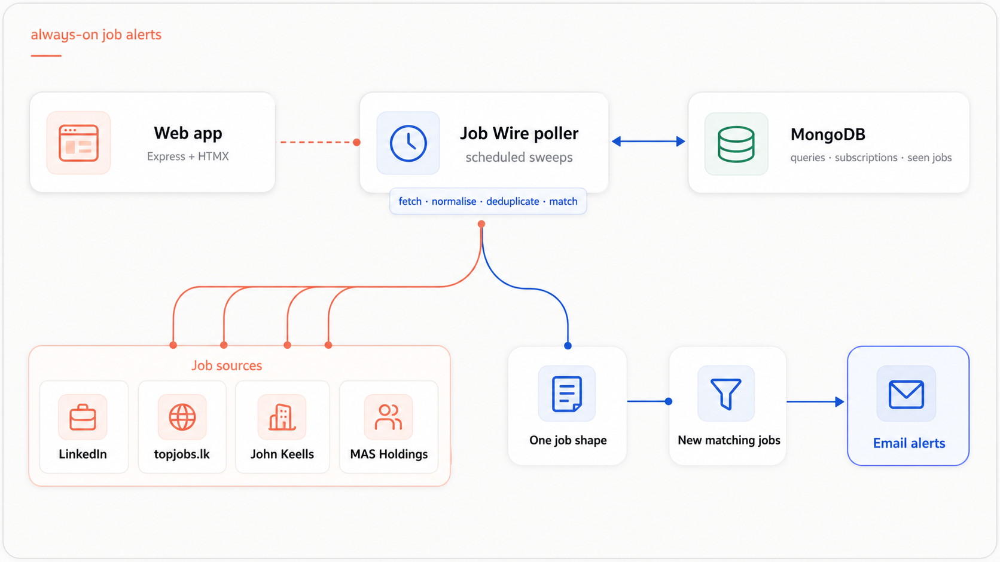
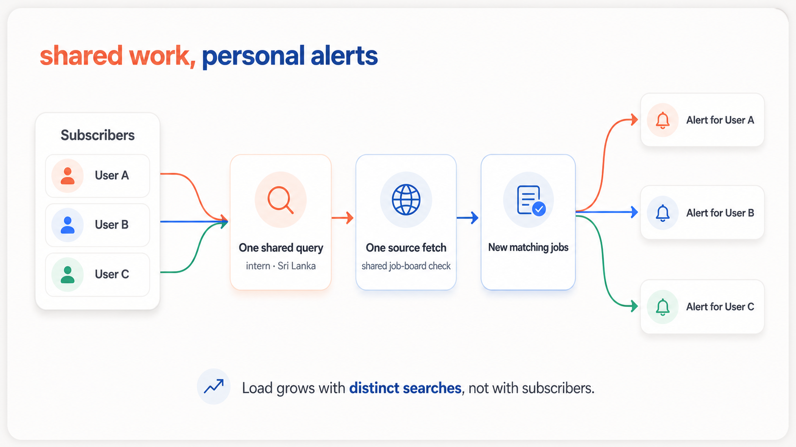

<div align="center">

# Job Wire

<a href="https://jobwire.me">
  
</a>

### Be early, by default.

**A job you'd be good at was posted while you were reading this.**<br>
By tonight it could be forty applications deep.

[Try Job Wire](https://jobwire.me) · four job sources · one watch · one useful email

</div>

---

## The whole product, in one hour


**09:14:** a role is posted. **09:16:** Job Wire catches it and emails you.
By 10:14, the application pile may already be too deep to matter.

Recruiters read the pile from the top. Being early is not an advantage over
the other candidates; it decides whether you are read **at all**.

That number is real: a PickMe internship measured during development took
**12 applications in its first 31 minutes**.

---

## How it works

One process. A web server and a poller sharing a Mongo pool, because splitting
them loses the shared connection and the in-memory schedule. That is the
entire reason this is not serverless.



### The sweep, step by step

```
every POLL_TICK_SECONDS:
  retry anything that failed to send last time
  find queries where nextFetchAt <= now
  for each, ONE AT A TIME:
      for every source that covers this country:
          fetch → parse → normalise
      new = fetched − already seen        (unique index on queryId+jobId)
      if not primed:  store everything, send nothing, mark primed
      else:
          refine the newest N            (LinkedIn: one request per job)
          drop matches too old to act on
          email every subscriber ONE batch
      reschedule
```

---

## Four rules carry the design

**Prime before you alert.** A brand-new watch finds hundreds of existing jobs.
Store them silently; alert only from the second sweep. Otherwise the first
email is a wall of stale posts.

**Identical searches share one fetch.** A hundred users watching
`intern / Sri Lanka` is one query row and one set of requests, fanned out to a
hundred emails. Load scales with *distinct searches*, not users.



**Sweep serially.** Ten simultaneous requests from one IP is what a scraper
looks like. A steady trickle is what a browser looks like.

**A silent shortfall is the failure mode.** Every bug this project has had
returned success and simply saw less.

---

## The thing that will keep biting you

Not one of these threw an error. Each was a sweep that *succeeded* and returned
fewer jobs; indistinguishable from a quiet morning. All measured against the
live site:

| What looked fine | What was actually happening |
|---|---|
| `f_TPR=r3600` (last hour) | empty document returned while jobs existed |
| `sortBy=DD` | not honoured; newest jobs sit on pages 2 to 3 |
| `keywords=Intern` | 24 results one minute, 3 the next: a ranker, not a filter |
| pagination cap of 100 | the feed is 232 deep; a 40-minute-old internship sat on page 19 |
| substring matching | `intern` matched `internal`; pulled in a Chief HR Officer |
| `matchedBy: unverified` | a failed request treated as a match, emailing three non-internships |
| 74 emails sent, 0 failures | every one filed as spam; DMARC broken, provider reported success |

Two defences exist because of this:

- **Coverage check:** each sweep compares against the best that query has ever
  done and logs `COVERAGE DROP` below half. A query that normally yields 60 and
  suddenly yields 10 has not gone quiet, it has gone blind.
- **`npm run parity`:** diffs our results against the live LinkedIn page and
  prints `MISSING` / `EXTRA`, exiting non-zero if anything is missing.

> **The one lesson worth taking from this repo:** a system that returns success
> and quietly does less is far more dangerous than one that crashes. A crash you
> fix in an hour. This took days to even notice.

---

## Sources

Which sites get searched is **derived from the country**, never chosen. Nobody
wants fewer sites searched for the same keyword, and the only wrong answers were
the available ones; ticking a Sri Lankan board for a German watch built
something that could never match.

| Source | Coverage | How data arrives | Lag |
|---|---|---|---|
| LinkedIn | every country | 3 public surfaces, HTML | **median 27 min** |
| topjobs.lk | Sri Lanka | server-rendered listing pages | instant |
| John Keells Group | Sri Lanka | server-rendered careers search | instant |
| MAS Holdings | Sri Lanka | Oracle Cloud Recruiting REST API | instant |

**That LinkedIn figure is measured, not promised.** Over 442 postings in a day:

```
best         1 min
median      27 min      ← the number that actually matters
75th pct    61 min
90th pct   121 min
under 15m      31%
```

Almost none of it is the sweep. A sweep takes ~100 seconds against a 5-minute
schedule, so the poller adds single-digit minutes; the rest is LinkedIn's own
public index, verified by walking their feed and finding jobs absent that were
plainly visible to a signed-in browser. The three local boards have no such lag
and they reach you within one sweep.

Say the smaller true number rather than the larger nice one. "Within minutes"
was on this page for weeks and was accurate about a third of the time.

Adding a board is one file in `services/sources/`. Nothing downstream, including dedupe,
storage, email and the UI, knows which site a job came from. Sources are resolved
at sweep time, so a new adapter reaches **every existing watch** without anyone
editing anything.

### The adapter contract

```js
export const id            = "topjobs";        // also the jobId prefix
export const label         = "topjobs.lk";     // what a user sees
export const hosts         = ["topjobs.lk"];   // guardedFetch allowlist
export const countries     = ["100446352"];    // empty = worldwide
export const timePrecision = "day";            // or "minute"

export async function fetchJobs({ keywords, geoId, matchAll }) { … }
export async function refine(jobs, { keywords }) { … }   // optional
```

**`timePrecision` is load-bearing.** Boards that print a date and no time
resolve every posting to midnight, so a job put up this morning already reads as
hours old. The freshness gate skips them entirely and leans on priming plus
dedupe instead. Getting this wrong meant Keells jobs appeared on the wire and
were *never once emailed*.

---

## Matching

Keywords match as **whole words with ordinary endings**, so `intern` reaches
`internship` and `interning` but not `internal`, `international` or `internet`.

```
  intern  ✔ Intern, Interns, Internship, Interning, Trainee
          ✘ Internal, International, Internet
```

Words meaning the same job expand automatically. `intern` also finds
`trainee`. The table is deliberately tiny: `graduate` and `junior` are excluded,
because plenty of those want experience an intern has not got.

For LinkedIn only, a job whose title does not match costs one extra request to
read its employment type and seniority. Employers routinely tag a role
`Internship` while titling it "Real Estate Sales Agent", and no title filter can
reach that. Those requests are budgeted per sweep, newest first; the rest carry
forward on a pending queue.

**What it deliberately does not read: the description.** It was tried, and it
faithfully reproduced LinkedIn's own mistakes, including a Senior Google Ads Specialist
and a Junior Estimator both reached the wire because their body text mentioned
interns. Employment type and seniority are fields an employer *set*. Prose is
not a claim about what the job is.

---

## Layout

```
src/
  server.js              express app + starts the poller in the same process
  config/                env validation, single Mongo pool
  models/                collection accessors, all indexes created at boot
  routes/                HTMX endpoints; return HTML fragments, not JSON
  middleware/            session, csrf, auth guard, admin guard, rate limits
  services/
    http/guardedFetch.js the ONLY outbound HTTP path; SSRF allowlist
    sources/             one file per job board, behind a shared contract
    linkedin/            url building, HTML parsing, geoId table
    poller/              the loop, one sweep, the dedupe rule, retry queue
    mail/                transport, send functions, templates
    auth/                bcrypt, code generate/verify
  views/                 ejs pages and HTMX partials
  utils/                 matching, time formatting, logging
public/                  css and the small vanilla JS htmx does not cover
```

---

## Running locally

```bash
cp .env.example .env     # then fill it in
npm install
npm run dev
```

Set `POLLER_ENABLED=false` while working on the UI. **Do this.** A local poller
against the production database sends real email alongside the deployed
instance; pairs of identical alerts two seconds apart are the symptom.

Rate limits skip loopback outside production. Four password resets an hour is
right for the internet and wrong for the machine building the feature.

| Command | What it does |
|---|---|
| `npm run e2e` | 48 assertions against a running server |
| `npm run parity` | diff our results against the live LinkedIn page |
| `npm run test-sweep` | one sweep, no email, prints what it found |
| `npm run verify-geoids` | check every geoId returns jobs in the right country |
| `npm run preview-email` | render the emails + 14 deliverability checks |
| `npm run measure-lag` | measure real indexing lag for your market |
| `npm run prune-matches` | re-test stored jobs against the current rules |
| `npm run set-password` | set a password from the terminal, echo off |

---

## Accounts

Email and password with bcrypt, plus a six-digit emailed code before a first
sign-in. Forgotten passwords use the same mechanism: a **code, not a link**,
because a clickable reset URL is the thing spam filters distrust most.

**A signup password is staged, not granted.** An unverified account is unowned:
anyone can type any address into the form. Writing the password immediately let
an attacker register a victim's address under a password of their choosing, and
the victim's own verification then blessed it. The hash now waits in
`pendingPassHash` until a correct code proves who holds the mailbox.

```
  attacker signs up as victim@…  ──▶  hash STAGED, nothing granted
  code goes to the victim         ──▶  attacker cannot verify
  victim signs up, gets a code    ──▶  their hash replaces the staged one
  victim enters the code          ──▶  their password is promoted
```

The reset endpoint never reveals whether an address has an account. Identical
wording is not enough on its own: awaiting the email send made the endpoint
answer in ~5s for a real address and ~0.7s for an unknown one, which reduces the
whole protection to a stopwatch. The send is detached for that reason.

Admin is an env var, not a database flag:

```bash
ADMIN_EMAILS=you@example.com,someone@else.com
```

Nothing with write access to Mongo can promote itself, and there is no
first-admin bootstrap problem. A non-admin gets **404, not 403**; "forbidden"
confirms the page is real.

---

## Email deliverability

A new user's first email is their verification code. If that lands in spam they
cannot sign up **at all**, so this matters more than any feature.

**The one thing that matters most.** Sending as a `gmail.com` address through a
third-party relay breaks DMARC; only Google may send as gmail.com, so the relay
claims a domain it cannot prove. Gmail accepts the message and files it as spam,
and the provider reports zero failures the entire time.

```
  Symptom:  74 / 280 sent · 0 failed · empty inbox
```

The proper fix: own a domain, authenticate it in a transactional provider with
SPF and DKIM, and send as `alerts@yourdomain`. The `/admin` Delivery panel flags
the misalignment until you do.

**The alert email leads with age**, because that is the only number the product
is really about:

```
  2m old    Intern: Fintech Operations
            PickMe · Colombo
            Open on LinkedIn

  41m old   Trainee Software Engineer
            Epinics · Kandy
            Open on LinkedIn
```

No images, no coloured buttons, no bulk-mail footer, a real `text/plain`
alternative, `List-Unsubscribe` on both transports. Those are deliverability
decisions, not a lack of ideas; anything decorative costs inbox placement this
account cannot afford. `npm run preview-email` asserts all fourteen.

---

## Things that will bite you

**LinkedIn does not want to be polled.** It is against their terms, they
rate-limit hard, and shared cloud IPs are often already flagged. All the
fragility lives in `services/linkedin/parse.js`; keep it isolated.

**A 200 is not a success.** Responses are classified, not assumed: markup with
no job cards raises an error rather than reporting zero jobs. Oracle's API will
happily return 200 with no `requisitionList` if the finder syntax is wrong.

**geoIds must be verified.** A wrong one fails silently and searches the wrong
country. `npm run verify-geoids` checks all 45.

**The TTL index on `seenJobs` is not optional.** Without it the collection grows
forever on a 512 MB Atlas tier. With it, storage is steady state.

**`numReplicas` must stay at 1.** Two replicas means two pollers sweeping the
same queries.

**Do not deploy to Vercel.** Serverless functions are destroyed between
requests, so the loop cannot exist.

**`pkill` does not kill node on Windows.** Use `taskkill //F //IM node.exe`, or
a stale server keeps port 3000 and your health check passes against code from an
hour ago.

---

## Deploying

One always-on service. The web app and the poller share a process, so anything
that sleeps or recycles between requests breaks the product.

**Railway (current target).** `railway.json` builds from the Dockerfile and
points the healthcheck at `/healthz`.

1. New Project → Deploy from GitHub repo
2. Variables → everything from `.env.example` except `PORT` (Railway injects its own)
3. Set `APP_URL` to your domain; canonical tags and email links both read it
4. MongoDB Atlas → Network Access → allow `0.0.0.0/0`, because Railway's egress
   IPs are not fixed

The Dockerfile forces IPv4 DNS ordering. Without it, outbound SMTP fails with
`ENETUNREACH` on an IPv6 address that has no route; 43 consecutive send
failures in one evening before that was found.

**Render (alternative).** `render.yaml` is a blueprint for the same single
service. Free instances sleep after ~15 minutes idle, which stops the poller;
hence `plan: starter`.

---

## Licence

[MIT](LICENSE). Use it, change it, ship it; keep the copyright notice.

One thing the licence does **not** cover, and cannot: it applies to this
source code, not to the sites it reads. Job Wire polls LinkedIn's public
guest endpoints, which is against LinkedIn's terms of service. MIT-licensing a
scraper grants you rights to the scraper; it grants nobody permission to
scrape. If you fork this, that decision is yours to make and yours to own.

---

<div align="center">

Built because good applications lose to early ones.

</div>
